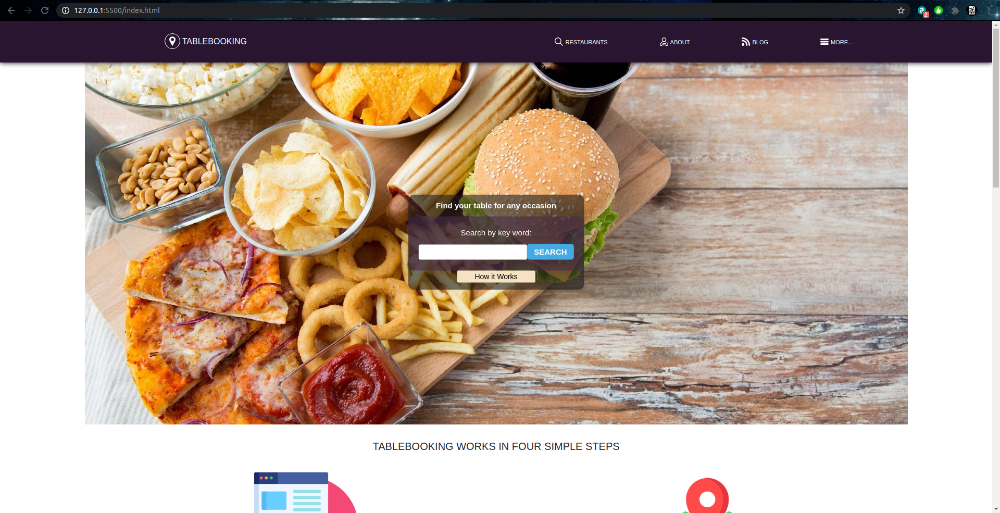

## Booking Website

> This is a layout of a restaurant website. The front page include the search form a the very beginning, and below have information about the website. Also the project incldue a search result with a filter form to make the search more specific and shows the result with some of the restaurant information below it. To finish the project include as well a profile page made when you click on any of the result from the search result page, this page include pictures and detail information about the restaurant also a form to book a table.

## Built With

- HTML
- CSS
- Bootstrap

## Live Demo

[Live Demo Link](https://jaar91.github.io/HTML-Capstone-Project/)

## Getting Started

Be sure to have a github account and that this account is connected locally on your PC

### Setup

Create a new folder/directory for the project

### Install

- open your terminal on your OS
- go to the desired folder/directory that you want to have the project in
- git clone gh repo clone JAAR91/HTML-Capstone-Project

## Author

👤 **Jose Alberto Arriaga Ramos**

- GitHub: [@jaarkira](https://github.com/jaarkira )
- Twitter: [@91_jaar](https://twitter.com/91_jaar )
- LinkedIn: [Jose Arriaga](https://www.linkedin.com/in/jose-arriaga-63a851204/)

## 🤝 Contributing

Contributions, issues, and feature requests are welcome!

Feel free to check the [issues page](issues/).

## Show your support

Give a ⭐️ if you like this project!

## Acknowledgments

- Hat tip to anyone whose code was used
- Inspiration
- etc

## 📝 License

This project is [MIT](lic.url) licensed.
