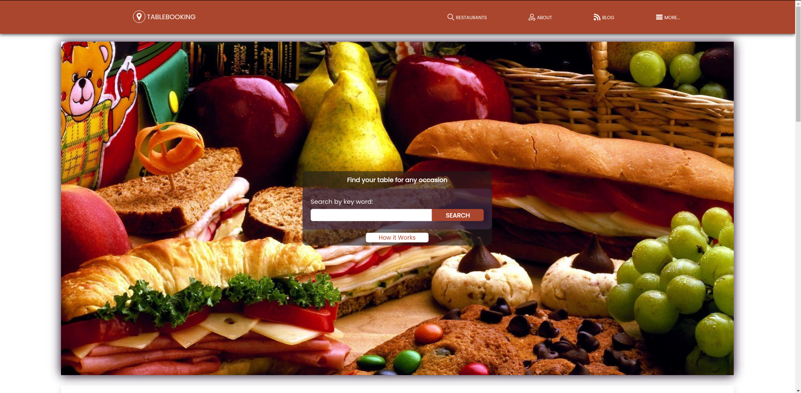
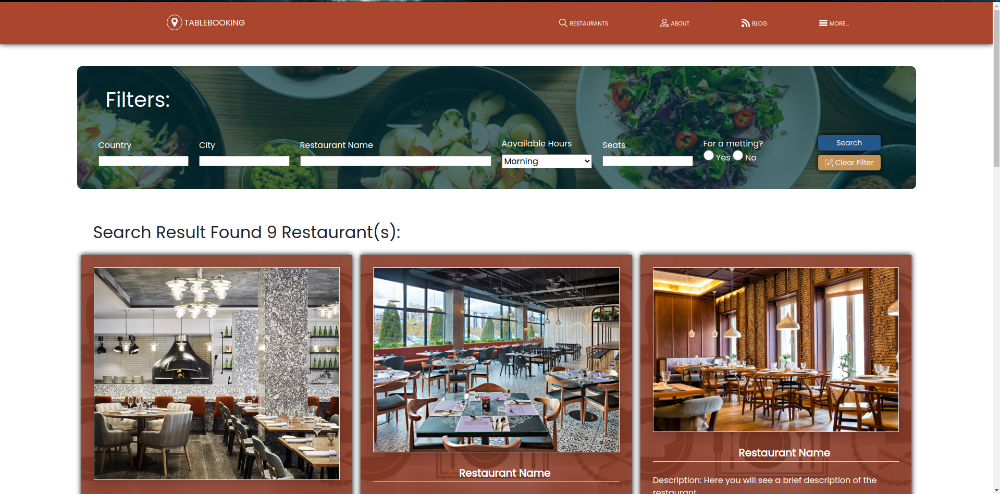
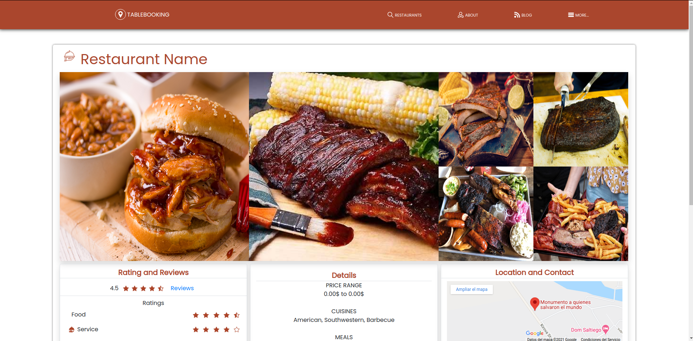

## Booking Website
Layout of a booking website, that allows book tables from restaurants on your area. Fully responsive. Project include: 

- The front page that includes the search "form" at the beginning that will take you to a search result page, below it has information and description about the website. 

- Search result page with a filter form to make the search more specific and the results are displayed below the filter form. Each of the results contains short information about the restaurant including a small description, working hours, and reviews. 

- Restaurant profile page that you can reach by clicking on any of the results from the search result page. Here you can find more details about the restaurant like food photos, location and contact information, and finally a form to book a table.





## Built With

- HTML
- CSS
- Bootstrap

## Live Demo

[Live Demo Link](https://jaar91.github.io/HTML-Capstone-Project/)


## Getting Started

Be sure to have a github account and that this account is connected locally on your PC

### Install

First we need to clone the repository to your local files, for that use the following command on your terminal:
```
$ git clone git@github.com:JAAR91/HTML-Capstone-Project.git
```
Now we have to acces the folder we just created:
```
$ cd HTML-CAPSTONE-PROJECT
```
To run the project you can use vscode "live server" extension but just opening Index.html file with any browser will to the job.

## Author

👤 **Jose Alberto Arriaga Ramos**

- GitHub: [@jaarkira](https://github.com/jaarkira )
- Twitter: [@91_jaar](https://twitter.com/91_jaar )
- LinkedIn: [Jose Arriaga](https://www.linkedin.com/in/jose-arriaga-63a851204/)

## 🤝 Contributing

Contributions, issues, and feature requests are welcome!

Feel free to check the [issues page](issues/).

## Show your support

Give a ⭐️ if you like this project!

## Acknowledgments

- Hat tip to anyone who use code was used
- Inspiration
- etc

## 📝 License

This project is [MIT](lic.url) licensed.